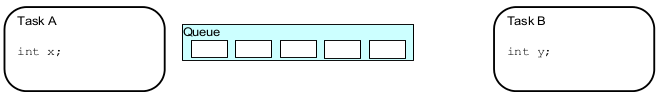
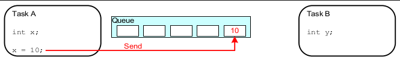
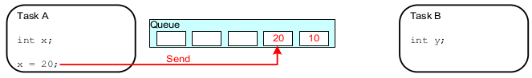
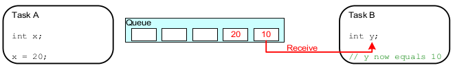
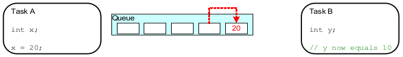
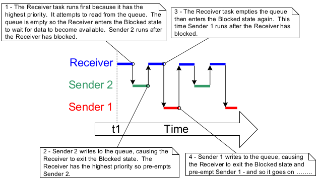
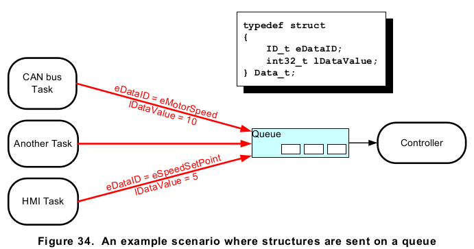
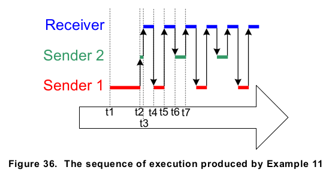

<h1 style="font-size: 72px">
freeRTOS Queue Management
</h1>
<br />

JunYuan Yan

<div align="right">
  <font size="3">
forked from [Git , Denny Huang ](http://denny.one/git-slide)
  </font>
</div>

----

# About me

* i-cube Lab @ NUU
* R&D @ [BotPartner.me](http://www.botpartner.me)
* contact me : jyyan.tw@gmail.com
* [blog](http://blog.jyyan.info) , jyyan @ [github](http://github.com/jyyan)

---

# Introduction

* Why ?
* Using a Queue
* Receiving Data From Multiple Sources
* Working with large or variable sized Data
* Receiving from multiple Queue
* Using a Queue to create a mailbox

---

# Why ?

----

# Characteristics
## of a Queue

* hold a finite number of fixed size data items.
* as First In First Out (FIFO) buffers.

----

# initial
## a queue

<div align="center">
  
</div>

```
A queue is created to allow Task A and Task B to communicate.
The queue can hold a maximum of 5 integers.
When the queue is created it does not contain any values so is empty.
```

----

# push
## a value into queue

<div align="center">
  
</div>

```
Task A writes (sends) the value of a local variable to the back of the queue.
As the queue was previouslyi empty the value written is now the only item in
the queue, and is therefore both the value at the back of the queue and the
value at the front of the queue.
```

----

# push
## another value into queue

<div align="center">
  
</div>

```
Task A changes the value of its local variable before writing it to the queue again.
The queue nowi contains copies of both values written to the queue. The first value
written remains at the front of the queue, the new value is inserted at the end of
the queue. The queue has three empty spaces remaining.
```

----

# pop out
## (read & delete)

<div align="center">
  
</div>

```
Task B reads (receives) from the queue into a different variable. The value received
by Task B is the value from the head of the queue, which is the first value Task A
wrote to the queue (10 in this illustration)
```

----

# pop out

## (shift)

<div align="center">
  
</div>
```
Task B has removed one item, leaving only the second value written by Task A remaining
in the queue. This is the value Task B would receive next if it read from the queue
again. The queue now has four empty spaces remaining.
```

----

## Behavior by method

1. Queue by copy
 * Queuing by copy means the data sent to the queue is copied byte for byte into the
queue.
1. Queue by reference
 * Queuing by reference means the queue only holds pointers to the data sent to the
queue, not the data itself.

----

## freeRTOS Queue Behavior

* Using *Queue by Copy* method.
* Access by multiple Tasks
* Blocking on Queue Reads
* Blocking on Queue Writes
* Blocking on multiple Queus

---


# Using a Queue
[Example](https://github.com/freeRTOS-Taipei/workshop_exsample/tree/master/lab3)

----

```
#include <Arduino_FreeRTOS.h>
#include <queue.h>
```

----

### xQueueCreate
```
QueueHandle_t xQueueCreate(
  UBaseType_t uxQueueLength,
  UBaseType_t uxItemSize );
```
* uxQueueLength
  * The maximum number of items that the queue being created can hold at any one time.
* uxItemSize
  * The size in bytes of each data item that can be stored in the queue.
* Return Value : If NULL is returned, then the queue cannot be created.
* [Ref](http://www.freertos.org/a00116.html)

----

### xQueueSendToFront & xQueueSendToBack
```
BaseType_t xQueueSend(
  QueueHandle_t xQueue,
  const void * pvItemToQueue,
  TickType_t xTicksToWait);

BaseType_t xQueueSendToFront(
  QueueHandle_t xQueue,
  const void * pvItemToQueue,
  TickType_t xTicksToWait );

BaseType_t xQueueSendToBack(
  QueueHandle_t xQueue,
  const void * pvItemToQueue,
  TickType_t xTicksToWait );
```
* xQueueSend eq. xQueueSendToBack
* ref [1](http://www.freertos.org/a00117.html) , [2](http://www.freertos.org/xQueueSendToFront.html) , [3](http://www.freertos.org/xQueueSendToBack.html)

----
### xTicksToWait
* The maximum amount of time the task should remain in the Blocked
state to wait for space to become available on the queue, should the
queue already be full.
* Both xQueueSendToFront() and xQueueSendToBack() will return
immediately if xTicksToWait is zero and the queue is already full.
The block time is specified in tick periods, so the absolute time it
represents is dependent on the tick frequency.

----

* The macro pdMS_TO_TICKS() can be used to convert a time specified in
milliseconds into a time specified in ticks.
Setting xTicksToWait to portMAX_DELAY will cause the task to wait
indefinitely (without timing out), provided INCLUDE_vTaskSuspend is
set to 1 in FreeRTOSConfig.h.

----
### xQueueReceive
```
BaseType_t xQueueReceive(
  QueueHandle_t xQueue,
  void * const pvBuffer,
  TickType_t xTicksToWait );
```
* pvBuffer
 * A pointer to the memory into which the received data will be copied.
The size of each data item that the queue holds is set when the queue
is created. The memory pointed to by pvBuffer must be at least large
enough to hold that many bytes.

----


```
UBaseType_t uxQueueMessagesWaiting( QueueHandle_t xQueue );
```
* uxQueueMessagesWaiting() is used to query the number of items that are currently in a
queue.
* Note : Never call uxQueueMessagesWaiting() from an interrupt service routine. The interrupt-safe uxQueueMessagesWaitingFromISR() should be used in its place.

----
<div align="center">
  
</div>
Lab3.1.1

---

# Receiving Data From Multiple Sources
[Example](https://github.com/freeRTOS-Taipei/workshop_exsample/tree/master/lab3)

----

<div align="center">
  
</div>
Lab3.2

----

<div align="center">
  
</div>
Lab3.2

---

# Working with large or variable sized Data

----

### Declare
```
/* Declare a variable of type QueueHandle_t to hold the handle of the queue being created. */
QueueHandle_t xPointerQueue;
/* Create a queue that can hold a maximum of 5 pointers, in this case character pointers. */
xPointerQueue = xQueueCreate( 5, sizeof( char * ) );
```

----

```
/* A task that obtains a buffer, writes a string to the buffer, then sends the address of the
buffer to the queue created in Listing 52. */
void vStringSendingTask( void *pvParameters )
{
  char *pcStringToSend;
  const size_t xMaxStringLength = 50;
  BaseType_t xStringNumber = 0;
  for( ;; )
  {
    /* Obtain a buffer that is at least xMaxStringLength characters big. The implementation
    of prvGetBuffer() is not shown – it might obtain the buffer from a pool of pre-allocated
    buffers, or just allocate the buffer dynamically. */
    pcStringToSend = ( char * ) prvGetBuffer( xMaxStringLength );
    /* Write a string into the buffer. */
    snprintf( pcStringToSend, xMaxStringLength, "String number %d\r\n", xStringNumber );
    /* Increment the counter so the string is different on each iteration of this task. */
    xStringNumber++;
    /* Send the address of the buffer to the queue that was created in Listing 52. The
    address of the buffer is stored in the pcStringToSend variable.*/
    xQueueSend( xPointerQueue,
    /* The handle of the queue. */
    &pcStringToSend, /* The address of the pointer that points to the buffer. */
    portMAX_DELAY );
  }
}
```

----

```
/* A task that receives the address of a buffer from the queue created in Listing 52, and
written to in Listing 53. The buffer contains a string, which is printed out. */
void vStringReceivingTask( void *pvParameters )
{
  char *pcReceivedString;
  for( ;; )
  {
    /* Receive the address of a buffer. */
    xQueueReceive( xPointerQueue,
    /* The handle of the queue. */
    &pcReceivedString, /* Store the buffer’s address in pcReceivedString. */
    portMAX_DELAY );
    /* The buffer holds a string, print it out. */
    vPrintString( pcReceivedString );
    /* The buffer is not required any more - release it so it can be freed, or re-used. */
    prvReleaseBuffer( pcReceivedString );
  }
}
```

---

# Receiving from multiple Queue
[Example](https://github.com/freeRTOS-Taipei/workshop_exsample/tree/master/lab3)

1. Creating a queue set.
2. Adding queues to the set.
3. Reading from the queue set to determine which queues within the set contain data.

----
## Queue set
* Queue set functionality is enabled by setting the `configUSE_QUEUE_SETS` compile time configuration constant to 1 in `FreeRTOSConfig.h`

----

* path :
* %Arduino_Root%/libraries/FreeRTOS/src/FreeRTOSConfig.h

```
#define configUSE_MUTEXES                   1
#define configUSE_RECURSIVE_MUTEXES         1
#define configUSE_COUNTING_SEMAPHORES       1
#define configUSE_QUEUE_SETS                1   // this one
```

----
### API

```
QueueSetHandle_t xQueueCreateSet(
  const UBaseType_t uxEventQueueLength );

BaseType_t xQueueAddToSet(
  QueueSetMemberHandle_t xQueueOrSemaphore,
  QueueSetHandle_t xQueueSet );

QueueSetMemberHandle_t xQueueSelectFromSet(
  QueueSetHandle_t xQueueSet,
  const TickType_t xTicksToWait );
```

---

# Using a Queue to create a mailbox

----
A queue is used to send data from one task to another task, or from an interrupt
service routine to a task. The sender places an item in the queue, and the receiver
removes the item from the queue. The data passes through the queue from the sender
to the receiver

----

A mailbox is used to hold data that can be read by any task, or any interrupt service
routine.
The data does not pass through the mailbox, but instead remains in the
mailbox until it is overwritten. The sender overwrites the value in the mailbox. The
receiver reads the value from the mailbox, but does not remove the value from the
mailbox.

----

### API xQueueOverwrite

```
BaseType_t xQueueOverwrite( QueueHandle_t xQueue,
  const void * pvItemToQueue );
```

* Like the xQueueSendToBack() API function, the xQueueOverwrite() API function sends data to a queue.
* Unlike xQueueSendToBack(), if the queue is already full, then xQueueOverwrite() will overwrite data that is already in the queue.


----

### API xQueueOverwrite
```
void vUpdateMailbox( uint32_t ulNewValue )
{
  /* Example_t was defined in Listing 67. */
  Example_t xData;
  /* Write the new data into the Example_t structure.*/
  xData.ulValue = ulNewValue;
  /* Use the RTOS tick count as the time stamp stored in the Example_t structure. */
  xData.xTimeStamp = xTaskGetTickCount();
  /* Send the structure to the mailbox - overwriting any data that is already in the
  mailbox. */
  xQueueOverwrite( xMailbox, &xData );
}
```

----

### API xQueuePeek
```
BaseType_t xQueuePeek( QueueHandle_t xQueue,
  void * const pvBuffer,
  TickType_t xTicksToWait );
```
* xQueuePeek() is used to receive (read) an item from a queue without the item being removed from the queue.
* xQueuePeek() receives data from the head of the queue, without modifying the data stored in the queue, or the order in which data is stored in the queue.

----

### API xQueuePeek
```
BaseType_t vReadMailbox( Example_t *pxData )
{
  TickType_t xPreviousTimeStamp;
  BaseType_t xDataUpdated;
  /* This function updates an Example_t structure with the latest value received
  from the mailbox. Record the time stamp already contained in *pxData before it
  gets overwritten by the new data. */
  xPreviousTimeStamp = pxData->xTimeStamp;
  /* Update the Example_t structure pointed to by pxData with the data contained in
  the mailbox. If xQueueReceive() was used here then the mailbox would be left
  empty, and the data could not then be read by any other tasks. Using
  xQueuePeek() instead of xQueueReceive() ensures the data remains in the mailbox.
  A block time is specified, so the calling task will be placed in the Blocked
  state to wait for the mailbox to contain data should the mailbox be empty. An
  infinite block time is used, so it is not necessary to check the value returned
  from xQueuePeek(), as xQueuePeek() will only return when data is available. */
  xQueuePeek( xMailbox, pxData, portMAX_DELAY );
  /* Return pdTRUE if the value read from the mailbox has been updated since this
  function was last called. Otherwise return pdFALSE. */
  if( pxData->xTimeStamp > xPreviousTimeStamp )
  {
    xDataUpdated = pdTRUE;
  }
  else
  {
    xDataUpdated = pdFALSE;
  }
  return xDataUpdated;
}
```


---

## Thanks for your attention!

<br /><br /><br />
<div align="center">
  
</div>
<h2 style="font-size: 18px">
本投影片採用<a href="http://creativecommons.org/licenses/by-sa/3.0/tw/" target="_blank">創用 CC「姓名標示—相同方式分享 3.0 台灣」授權條款</a>
</h2>

